# Boston Bus Equity

Spark Project - Public transport plays an important role in the quality of life for residents in Massachusetts and Boston in terms of economic development, the environment, and equity. The goal of this project is to better understand the impact of bus performance on Boston residents by using MBTA bus data to examine service performance trends by geography. More information on this specific project from Spark can be found [here](https://docs.google.com/document/d/1BDWIXxLIoyoAc7ZoDu54bQZFiHViBrydTfgQigjtaNY/edit?tab=t.0).

### Final Report Video Link:

[Final Presentation and Overview](https://youtu.be/dal5o1wtGpI)

### Local setup and testing (important to run files locally):

 We have included a requirements.txt file with necessary dependencies. Sample csv files have been generated and added to the datasets folder. These mimic the full datasets downloadable below, but folders and files have had the suffic _Sample added. This will need to be included in notebook files for local testing. The files we used to generate the visualizations are listed at the end of each respective section.

### Datasets:

We  used the following datasets from the MBTA site:

- [Ridership data from 2018-2024](https://mbta-massdot.opendata.arcgis.com/datasets/8daf4a33925a4df59183f860826d29ee/about)
- [Bus Stop Location and IDs](https://mbta-massdot.opendata.arcgis.com/datasets/24a97982b39f4febb504c9e6cb55879b_0/explore)
- [Arrival and Departure Times 2019-2024](https://mbta-massdot.opendata.arcgis.com/search?collection=dataset&q=mbta%20bus%20arrival%20departure%20time)
- [2023 Passenger Wide Survey Data](https://mbta-massdot.opendata.arcgis.com/datasets/MassDOT::mbta-2023-system-wide-passenger-survey-data/about)

## Overview & Questions Addressed:

The Spark page includes a list of base questions to address. Each question has an associated notebook with analysis, details on specific topics are  below.  

### Ridership Data Processing and Modeling:
*What is the ridership per bus route? How has this changed from pre pandemic time to post pandemic time?*

Pre and post covid ridership was calculated using available monthly ridership data for the entire MBTA bus system and for available bus routes. Pre-covid pandemic data was considered as all data prior to 2019, and post-covid data as averages from 2022 2023, and 2024. Data from 2020 and 2021 was considered to be during covid and was not used, as this significantly impacted ridership. 

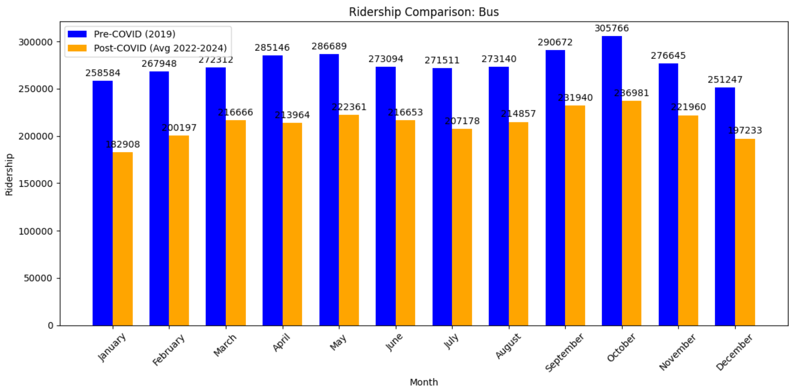
*Comparison of Ridership for all MBTA Routes*

We found that ridership has dropped across the MBTA bus system following COVID. Today, fewer people use the buses than 6 years ago. This is likely heavily influenced by the pandemic, as people may have begun to work from home or invest in alternative forms in transport. Following the end of the pandemic it appears that levels still have not returned to prepandemic levels. 

*The Jupyter Notebook used for this was ridership_routes.ipynb*

### End to End Data Processing and Modeling:
*What are the end-to-end travel times for each bus route in the city?*

The data, grouped by routes, will have an additional aggregate feature that contains the time in seconds between the arrival at the first stop and the arrival at the final stop. The intention of this feature is to reflect possible route efficiency changes over time, such as comparing pre and post-pandemic route duration times, along with the relative efficiency within areas of varying socioeconomic demographics. The motivation behind using route duration lies in its ability to contextualize route efficiency; it can be combined with other features like the number of stops to track per-stop efficiency, along with the accessibility and convenience of reaching certain areas of the city from areas of demographical interest.

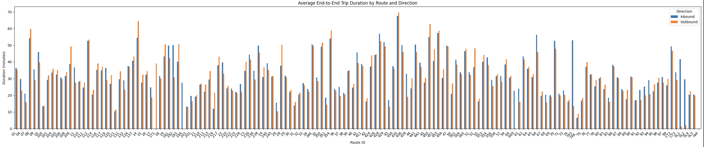
*Average end to end time for each bus route in the MBTA. The graph is colored orange for outbound buses and blue for inbound buses.*

*The Jupyter Notebook used for this was end_to_end_calc.ipynb*

### Wait Time Data Processing and Modeling:
*On average, how long does an individual have to wait for a bus (on time vs. delayed)?*

Wait times between buses can be calculated using headways data. Headways measure the scheduled and actual time between buses at specific stops. [Key routes](https://en.wikipedia.org/wiki/MBTA_key_bus_routes#) are routes with strict headway goals that they are expected to maintain during rush periods. We plotted scheduled and expected headways to understand how delays impacted wait times for bus riders. Headway was calculated for just weekdays, as weekends have different required scheduling goals. 

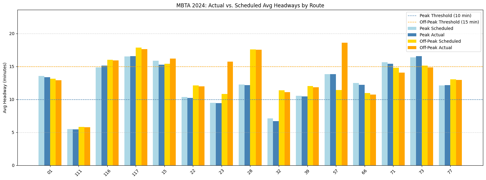
*Average scheduled vs actual headway by route on weekdays for 2024 season. Peak weekday times at 7:00am - 9:30am and 4:00pm - 6:30pm*

*The Jupyter Notebook used for this was bus_wait_time_average.ipynb*

### Delay Data Processing and Modeling:
*What is the average delay time of all routes across the entire city?*
*What is the average delay time of the target bus routes (22, 29, 15, 45, 28, 44, 42, 17, 23, 31, 26, 111, 24, 33, 14 - from Livable Streets report)?*

Delays for individual bus trips was calculated by subtracting the actual arrival time from the scheduled arrival time in the arrival and departure dataset. This was then grouped by route and stop to find average and maximum delay times for all routes and stops. We were also able to look at other delay factors, such as percentage of buses more than 5 minutes late, as well as analyze the change in delays over time. We associated these results with available geospatial data for bus stop and route locations to cluster stops and visually analyze locational disparities in ArcGIS.

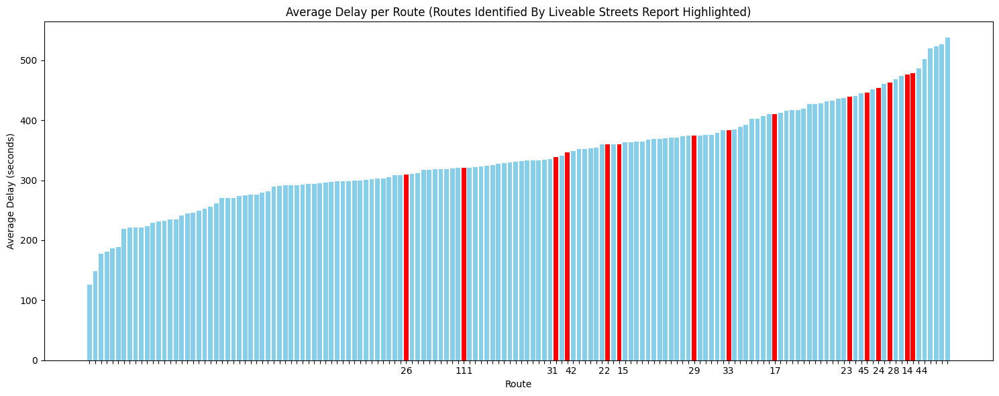
*Average delay for each route in the MBTA. Routes highlighted by the Livable Streets Report are highlighted in red.*

Looking across the MBTA, we found that delays were common. Buses frequently run late, are held up in traffic, or are cancelled. Notably, buses highlighted in the Liveable Streets Report face some of the worse average delays. These are bus routes that primarily serve vulnerable communities. 

*The Jupyter Notebook used for this was average_delay_times_across_routes.ipynb*

### Route Level Service Disparities:
*Are there disparities in the service levels of different routes (which lines are late more often than others)?*
*Are there differences in the characteristics of the people most impacted*

For route levels service disparities, we compared ridership to headway, a measure of time between buses. This can give insight into the over or undercrowding of specifc bus routes, and shows what routes may need more resources. We also looked at routes with high delays and lowered ridership, to see if there was a correlation between delays and ridership. 

Using the 2024 survey, we have created graph breakdowns of different demographics (income, race, trip purpose, age, gender, and English-speaking).
Below are the graphs:

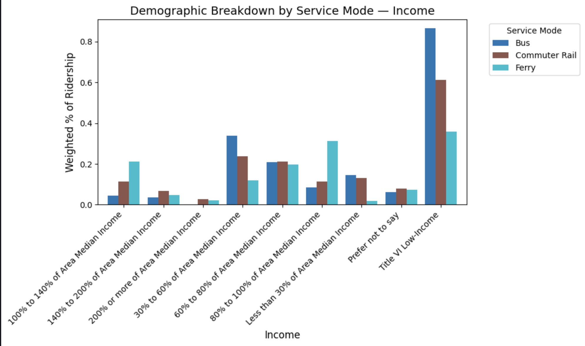
*Breakdown of MBTA riders and their most frequent mode of transportation categorized via income.*

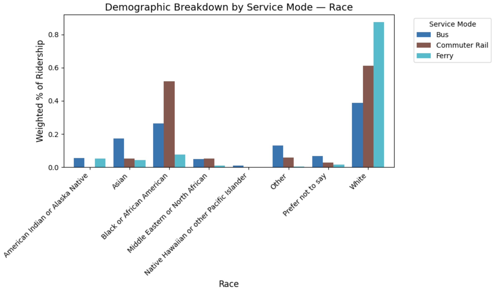
*Breakdown of MBTA riders and their most frequent mode of transportation categorized via race.*

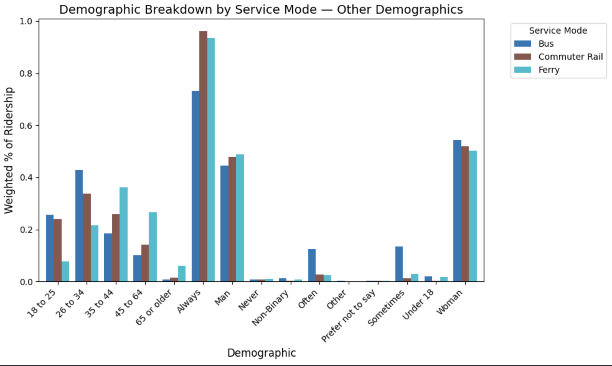
*Breakdown of MBTA riders and their most frequent mode of transportation categorized via age, gender, and English-speaking ability.*

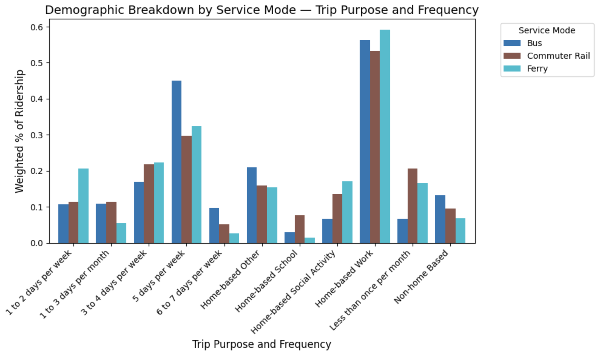
*Breakdown of MBTA riders and their most frequent mode of transportation categorized via trip purpose and frequency.*

*The Jupyter Notebook used for this was demographic.ipynb*

Through these graphs, we can deduce that lower income minorities use the bus more than people of medium or high income. We can also deduce that younger people (18-34) take the bus much more than their older counterparts, with the 26-34 age group being the most popular amongst the bus rider population. People who are also not as good at English (often or sometimes) prefer to take the bus much more than other modes of transportation (ferry or commuter rail). An overwhelming amount of people take the bus 5 times a week over alternative options, with a majority of the usage coming from home-based work or other activities under that category.

### Service Level Disparity Demographics

Using demographic survey data, average delays for routes, and daily ridership for routes we wanted to see how average delay changed by demographic. The 2023 MBTA survey contains a reporting group column that breaks cover a set of routes. We were able to calculate a weighted average delay for each reporting group and total daily ridership. As demographic data provides a percentage of individuals that fall into each reporting group, this could be used to see if there were widespread correlations between different demographics and delays experienced. Results are shown below:

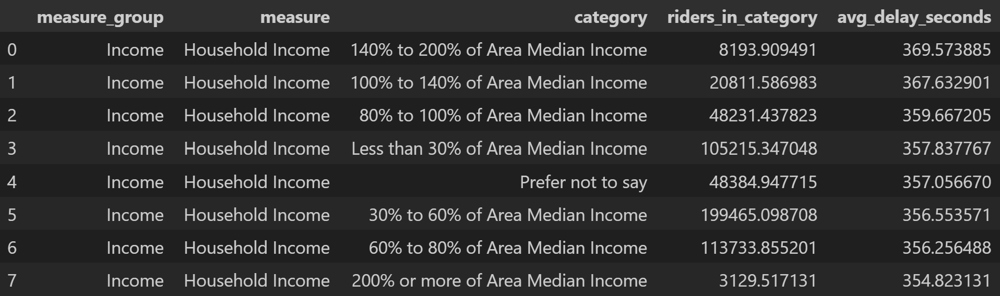
*Breakdown of average delay by income*

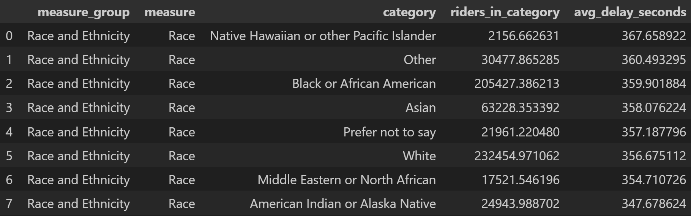
*Breakdown of average delay by ethnicity*

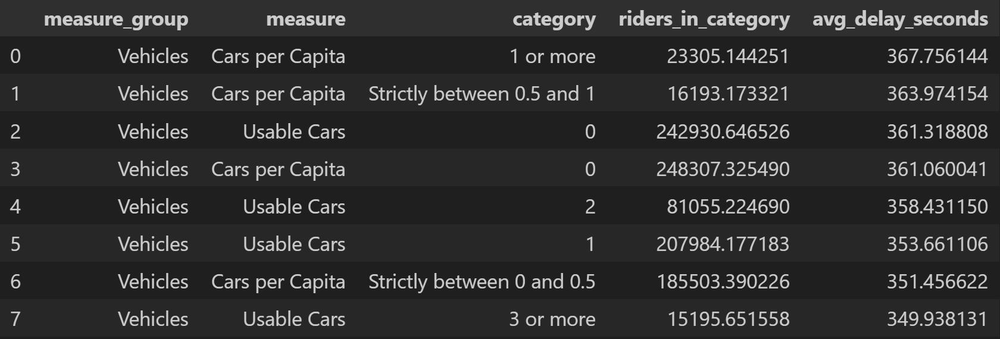
*Breakdown of average delay by number of cars owned*

We did not find significantly strong disparities betweeen income or ethnicity and delay. However, this might be because looking at data from this level is too generalized to provide any insightful information. However, we found that there was some relationship between cars per capita and delays. This may correlate more with location than anything, as individuals who live further from Boston may be likely to have more cars. These areas would not be as well supported by public transportation and may face higher delays 

*The Jupyter Notebook used for this was average_delay_demographic_correlation.ipynb*

### Changes over time (2018-2024):
*Can we chart changes over time?*

To understand how the bus system has changed over time, we first examined levels of ridership between 2018 and 2024. This gave a broad picture into how the MBTA has changed. We also plotted the change in delays between 2018 and 2024. This let us understand what routes may have improved and what routes may need attention.

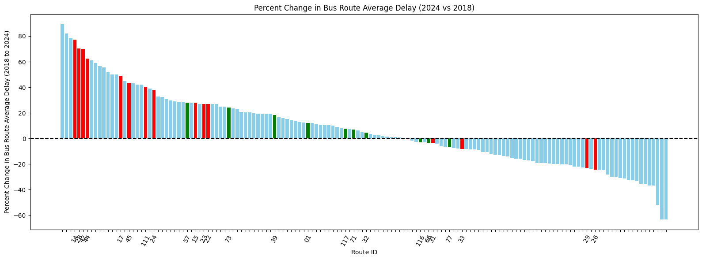
*Percent change in delay for routes over time. Routes highlighted by the Livable Streets Report are highlighted in red. Key routes are highlighted in green.*

Looking at changes over time, we found that most routes have had an increase in average delay since 2018. We also found that the percentage of buses more than 5 minutes late has increased for most routes, shown in our notebooks. Notably, routes highlighted by the Liveable Streets Report have seen significant increases in average delay since 2018. These routes primarily run through underserved communities and have previously been highlighted as needing improvements. However, this data only goes until 2024. The MBTA has released policy plans, available [here](https://www.mbta.com/projects/bus-network-redesign), that suggest changes for bus modernization beginning in 2025.  

*The Jupyter Notebook used for this was route_delay_change_over_time.ipynb*

### Results and Recommendations:

More key findings include:
- Persistently High Delays on Targeted Routes
  - 10 of the 15 routes flagged in the Livable Streets report rank in the top 20% city-wide for average end-to-end trip delay. Between 2018 and 2024, these routes saw an average +30% increase in mean delay which is nearly double the system-average increase of +16%.
- Concentrated “Hot Spots” of Delay
  - Mapping absolute average delay to individual stops reveals clear geographic clusters along Dorchester Avenue, Blue Hill Avenue, and Washington Street, areas already identified as mobility “deserts.” Stops in these clusters are 3× more likely to suffer > 5 min lateness than the MBTA network overall.
- Ridership Decline on High-Delay Corridors
  - Post-pandemic ridership has fallen 35 % system-wide, but on the high-delay corridors it has fallen by 45 %—suggesting a feedback loop between poor reliability and rider attrition.
- Equity Impacts
  - Survey and census data confirm that the neighborhoods along the most-delayed corridors have median household incomes well below city average, and a higher proportion of non-English speakers and non-white residents. Younger riders (18–34) and lower‐income households disproportionately report “missed connections” and “trip cancellations” on these high-delay routes, compounding barriers to work and essential services.

Some recommendations that we have include:
- Prioritize Bus-Only Lanes & Signal Priority on Hot Spots
  - Implementing bus-only lanes and transit signal priority pilots on the top 5 most-delayed corridors could reduce dwell times and offset traffic congestion.

- Adjust Headways & Reallocate Fleet
  - On the routes identified with the largest headway excess, increase peak-period frequency by reassigning spare buses from lower-ridership lines, targeting a 10–15% reduction in average headway.

- Equity-Focused Service Monitoring
  - Establish a quarterly “Equity Performance Dashboard” tracking on-time performance, ridership, and service frequency for all routes serving ZIP codes in the bottom 25% of median income. Publicly report these metrics to ensure accountability.

- Leverage 2025 Network Redesign
  - Integrate these equity priorities into the MBTA’s upcoming bus network redesign—ensuring that any route realignments or frequency shifts explicitly prioritize reliability on corridors with the greatest historical delays and ridership declines.

### Adjacent Findings:

We were able to create geospatial visualizations of where stops were most delayed using ArcGIS. Unfortunately, we did not have time to understand or look into this further. 

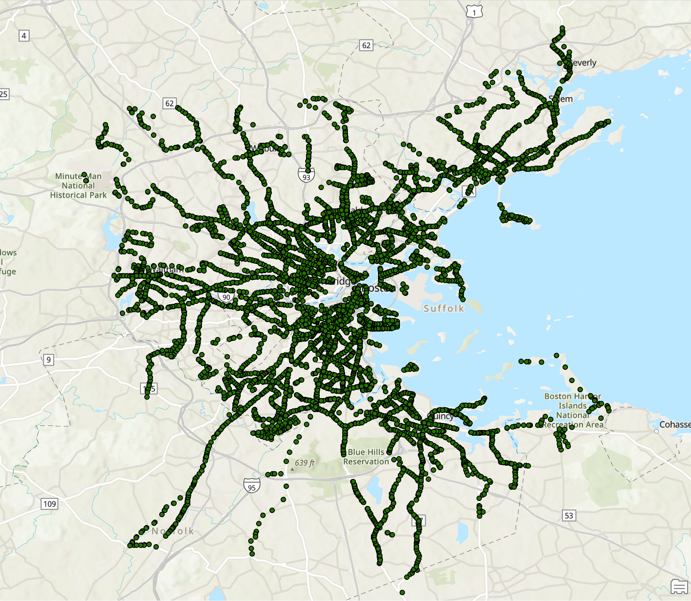

*All Boston Bus Stops*

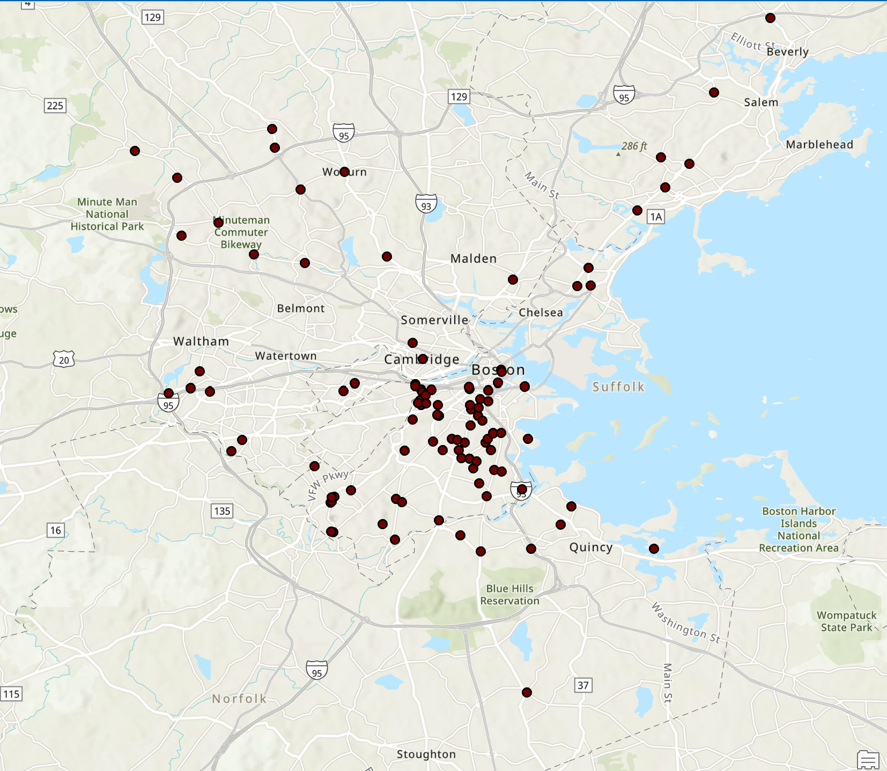

*10% of Bus Stops with Highest Recorded Absolute Average Delay*

More visualizations that may have been interesting or insightful but did not necessarily fit:

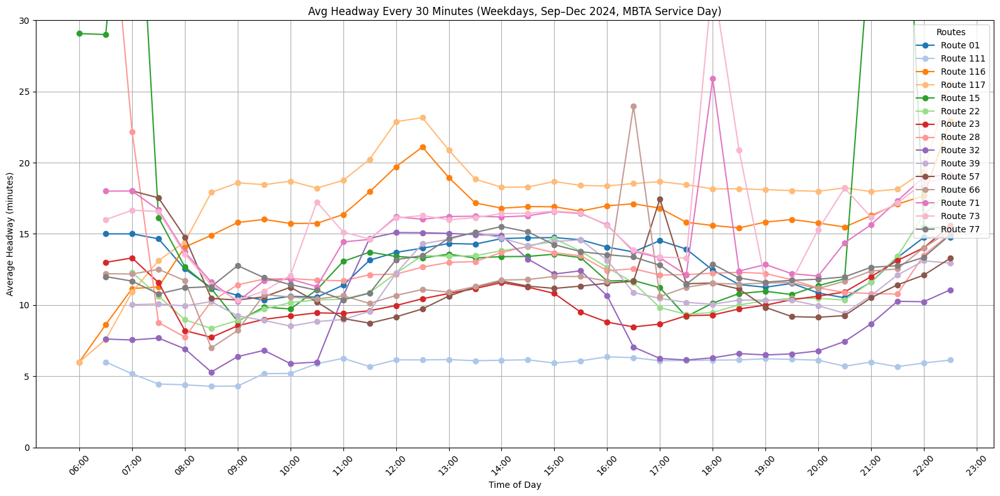

